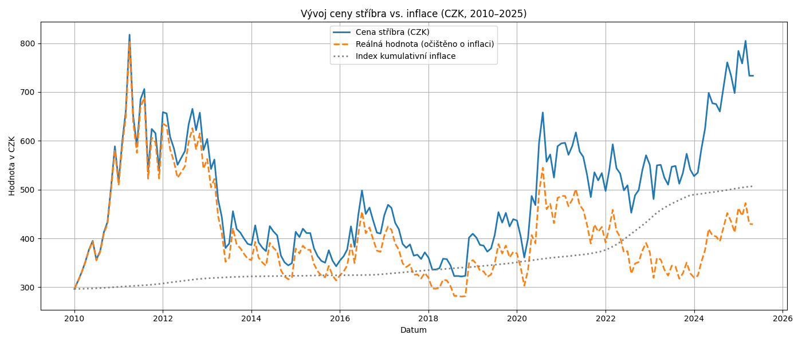
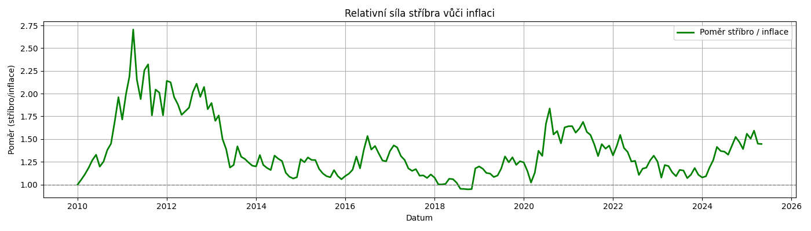

# 📈 Silver vs. Inflation – Analýza vývoje ceny stříbra

Tento projekt analyzuje vývoj ceny stříbra v letech 2010–2025 v českých korunách, očištěný o inflaci. Výsledky jsou vizualizovány a exportovány do Excelu a PNG souborů. Cílem je zjistit, zda investice do stříbra ochraňuje hodnotu peněz před inflací.

## 🔍 Co projekt obsahuje

- Načtení historických cen stříbra v USD
- Převod cen do CZK pomocí kurzů ČNB
- Načtení měsíční inflace z ECB
- Výpočet reálného zhodnocení (očištěného o inflaci)
- Poměr ceny stříbra k indexu inflace
- Vizualizace vývoje (PNG grafy)
- Export výsledků do `Silver_Analysis.xlsx`

## 🧰 Použité knihovny

Projekt využívá tyto knihovny: [requirements.txt](requirements.txt)

## 📂 Struktura souborů

- `main.py` – hlavní skript provádějící analýzu a výpočty
- `Silver Futures Historical Data.csv` – historická data o stříbře (USD)
- `Kurzy_CNB_USD.xlsx` – měsíční kurzy USD/CZK
- `ECB Data Portal_*.csv` – data o inflaci z ECB
- `Silver_Analysis.xlsx` – výstupní tabulka s výsledky
- `graf_stribro_s_inflaci.png` – graf CZK ceny stříbra vs. inflace
- `graf_stribro_vs_inflace_pomer.png` – graf poměru stříbra k inflaci

## ▶️ Jak spustit

1. Nainstaluj závislosti:
```bash
pip install -r requirements.txt
```

2. Spusť skript:
```bash
python main.py
```
3. Výsledky najdeš v adresáři jako .xlsx a .png soubory

## 📊 Ukázka grafů




## 📅 Období analýzy

Projekt pokrývá období: leden 2010 – červen 2025

## 📘 Licence
Tento projekt je poskytován pod licencí MIT.


